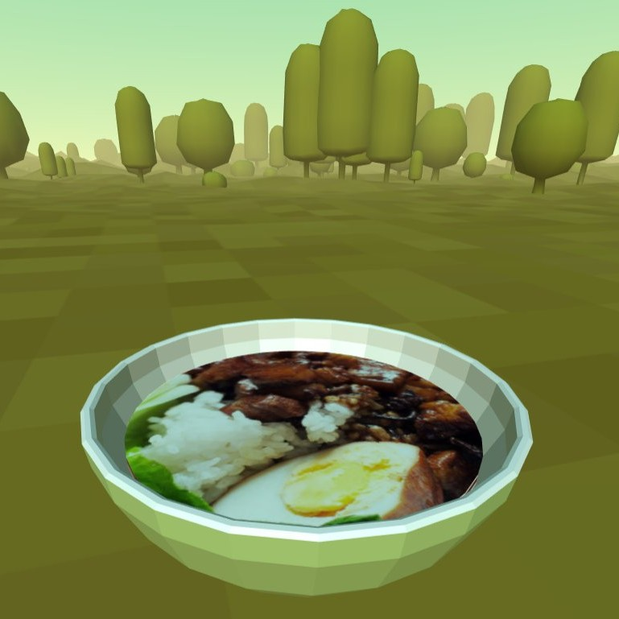

## aframe-food-component

[](https://npmjs.org/package/aframe-food-component)
[](https://npmjs.org/package/aframe-food-component)

 

Turn any picture of food into a 3D object for A-Frame <a href="https://banada.github.io/webvr/aframe-food-component"></a>

For [A-Frame](https://aframe.io).

### API

| Property | Description | Default Value |
| -------- | ----------- | ------------- |
|   src    |    image    |     null      |

### Installation

#### Browser

Add `food` to an a-entity and set the source to an image file.

You can crop an image [here](https://banada.github.io/webvr/aframe-food-component)

Install and use by directly including the [browser files](dist):

```html
<head>
  <title>My A-Frame Scene</title>
  <script src="https://aframe.io/releases/0.6.0/aframe.min.js"></script>
  <script src="https://unpkg.com/aframe-food-component/dist/aframe-food-component.min.js"></script>
</head>

<body>
  <a-scene>
    <a-entity food src="cropped_picture.jpg"></a-entity>
  </a-scene>
</body>
```

#### npm

Install via npm:

```bash
npm install aframe-food-component
```

Then require and use.

```js
require('aframe');
require('aframe-food-component');
```
